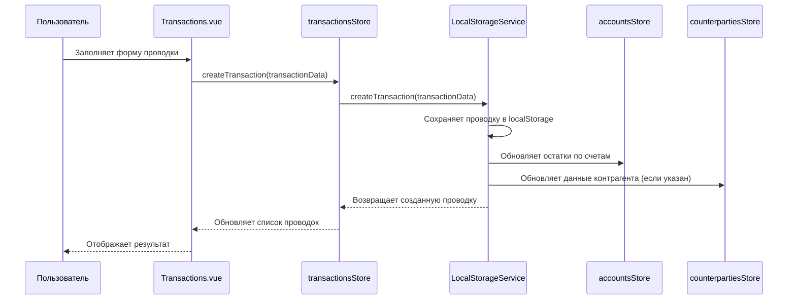
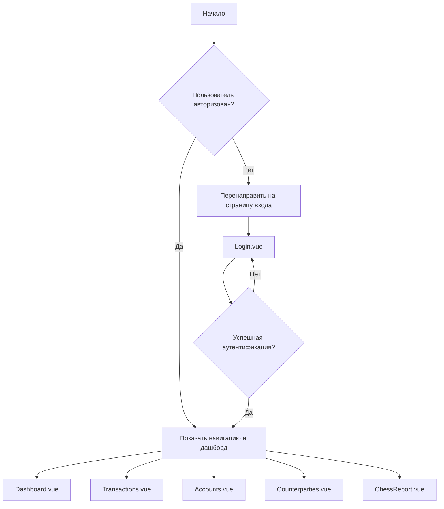
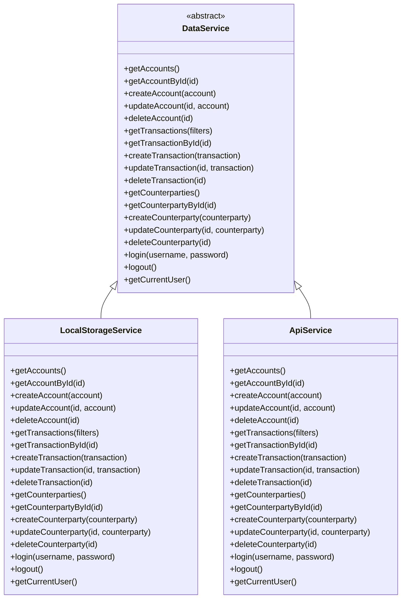

# Диаграмма архитектуры бухгалтерского приложения

## Обновлено: 12 сентября 2025

## Общая архитектура приложения

```mermaid
graph TB
    subgraph "Пользовательский интерфейс (Vue 3)"
        A[Login.vue] --> B[App.vue]
        C[Dashboard.vue] --> B
        D[Transactions.vue] --> B
        E[Accounts.vue] --> B
        F[Counterparties.vue] --> B
        G[ChessReport.vue] --> B
        
        subgraph "Общие компоненты"
            H[LoginForm.vue]
            I[Navigation.vue]
        end
    end
    
    subgraph "Управление состоянием (Pinia)"
        N[authStore]
        O[accountsStore]
        P[transactionsStore]
        Q[counterpartiesStore]
    end
    
    subgraph "Сервисы данных"
        R[DataService]
        S[LocalStorageService]
        T[ApiService<br/>(для будущего Spring Boot)]
    end
    
    subgraph "Модели данных"
        U[Account]
        V[Transaction]
        W[Counterparty]
    end
    
    subgraph "Хранилище"
        X[LocalStorage<br/>(текущее решение)]
        Y[Spring Boot API<br/>(будущее решение)]
    end
    
    B --> N
    B --> O
    B --> P
    B --> Q
    
    N --> R
    O --> R
    P --> R
    Q --> R
    
    R --> S
    R --> T
    
    S --> X
    T --> Y
    
    R --> U
    R --> V
    R --> W
    
    %% Обновленные связи для компонентов
    B --> H
    B --> I
```

## Поток данных при создании проводки



## Структура навигации и защиты маршрутов



## Слой абстракции данных



## Модели данных

```mermaid
classDiagram
    class Account {
        +String id
        +String code
        +String name
        +String type
        +Boolean isActive
        +Number balance
        +Boolean isFavorite
        +Date createdAt
        +Date updatedAt
    }
    
    class Transaction {
        +String id
        +Date date
        +String description
        +String debitAccountId
        +String creditAccountId
        +Number amount
        +String counterpartyId
        +Date createdAt
        +Date updatedAt
    }
    
    class Counterparty {
        +String id
        +String name
        +String inn
        +String address
        +String phone
        +String email
        +Date createdAt
        +Date updatedAt
    }
    
    Transaction "1" -- "1" Account : debitAccountId
    Transaction "1" -- "1" Account : creditAccountId
    Transaction "0..1" -- "1" Counterparty : counterpartyId