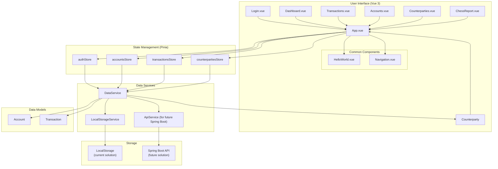
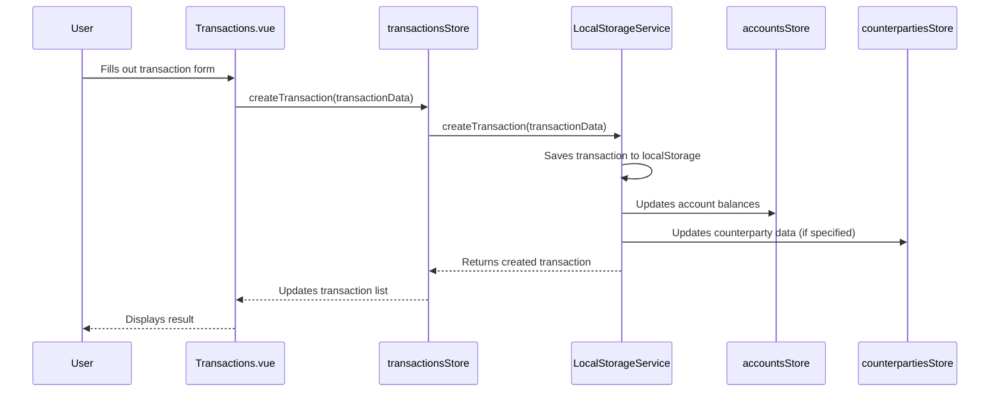
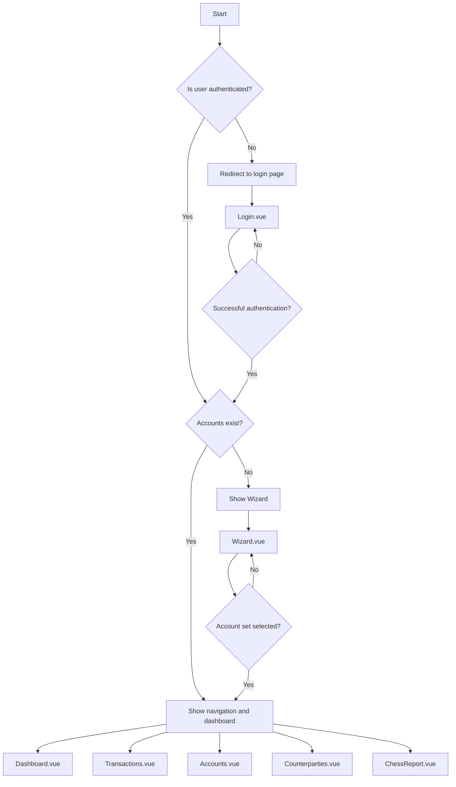
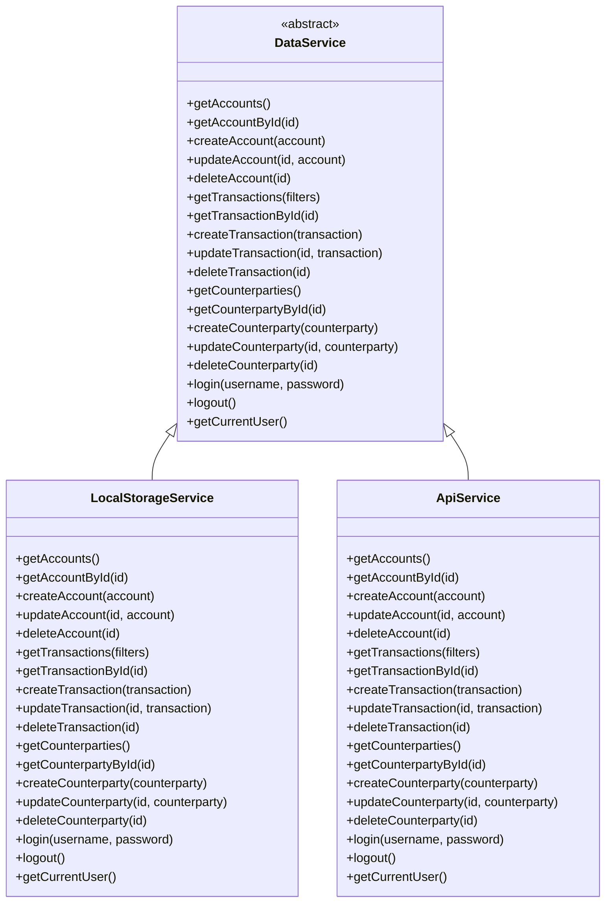

# Architecture Diagram of the Accounting Application

## Updated: September 25, 2025

## Overall Application Architecture



## Data Flow During Transaction Creation



## Navigation Structure and Route Protection



## Data Abstraction Layer



## Data Models

```mermaid
classDiagram
    class Account {
        +String id
        +String code
        +String name
        +String type
        +Boolean isActive
        +Number balance
        +Boolean isFavorite
        +Date createdAt
        +Date updatedAt
    }
    
    class Transaction {
        +String id
        +Date date
        +String description
        +String debitAccountId
        +String creditAccountId
        +Number amount
        +String counterpartyId
        +Date createdAt
        +Date updatedAt
    }
    
    class Counterparty {
        +String id
        +String name
        +String inn
        +String address
        +String phone
        +String email
        +Date createdAt
        +Date updatedAt
    }
    
    Transaction "1" -- "1" Account : debitAccountId
    Transaction "1" -- "1" Account : creditAccountId
    Transaction "0..1" -- "1" Counterparty : counterpartyId